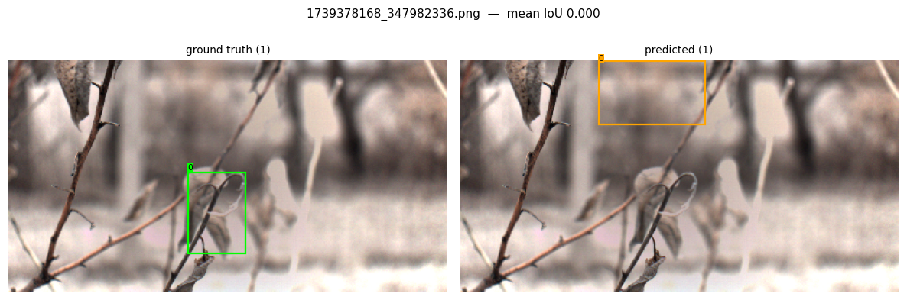
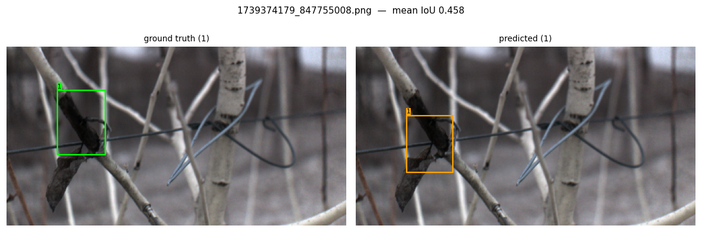
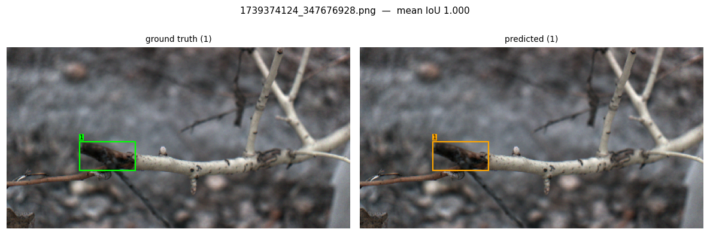

# Evaluation of Cross-Modal (RGB → NIR) Annotation Transfer via Stereo Reprojection

## Methodology

The annotation-transfer pipeline (`main.py`) copies existing bounding-box
annotations of fire blight symptoms (*Shepherd's Crook*, *Canker*) from the
RGB (visible-spectrum) camera onto the paired near-infrared (NIR) camera. It
does so by (1) predicting a depth map for the RGB stereo pair with
FoundationStereo, (2) refining the RGB boxes into pixel masks with SAM2,
(3) unprojecting the masked pixels to 3D using the RGB camera's calibrated
intrinsics, (4) rigidly transforming the point cloud into the NIR camera's
frame using the calibrated extrinsics, and (5) reprojecting and re-segmenting
the result in the NIR image plane. The motivation is to eliminate or reduce
manual re-annotation of NIR imagery, which otherwise requires labeling every
modality from scratch.

**Evaluation protocol.** Predictions are the pipeline's reprojected NIR boxes
from a single unattended run over 1,275 RGB frames with existing annotations
(44 frames, 3.5%, produced no usable prediction — see *Limitations*). Ground
truth is the same set of NIR frames after a human annotator reviewed and
corrected the reprojected boxes. **Because the ground truth is derived by
correcting the predictions rather than being collected independently, this
comparison is best read as a direct measurement of the manual correction
effort the pipeline saved an annotator, not as an independent benchmark of
detection accuracy against ground truth the pipeline never saw.** This is a
stronger, more practically relevant claim for a labeling-efficiency argument,
but it should be stated as such rather than as generic cross-modal detection
performance.

**Metrics.** The reprojected boxes carry no confidence score — the pipeline
emits one deterministic box set per frame rather than a ranked list of
candidate detections — so standard mAP is degenerate (it collapses to a
single precision/recall point). Instead, boxes are matched to ground truth
by greedy one-to-one IoU matching (per class, and once class-agnostically),
and precision, recall, F1, and the mean IoU of matched pairs are reported at
IoU thresholds of 0.25, 0.50, and 0.75. In addition, a **human-fix workload**
metric classifies every one of the 1,858 total annotations (matched ∪
unmatched, across prediction and ground truth) into one of four buckets at
each threshold:

- **ok** — matched to ground truth with IoU ≥ threshold (usable as-is)
- **adjust** — matched the correct object but IoU < threshold (needs resizing/moving)
- **add** — a ground-truth box with no corresponding prediction (must be drawn from scratch)
- **delete** — a predicted box with no corresponding ground truth (a spurious detection to remove)

## Results

**1,275 candidate frames → 44 (3.5%) produced no prediction (see Limitations). 1,632 ground-truth boxes vs. 1,788 predicted boxes across the remaining 1,231 frames.**

### Detection accuracy

| IoU threshold | Class | Precision | Recall | F1 | Mean IoU (matched) |
|---|---|---|---|---|---|
| 0.25 | Shepherd's Crook | 0.779 | 0.909 | 0.839 | 0.783 |
| 0.25 | Canker | 0.835 | 0.875 | 0.855 | 0.805 |
| 0.25 | **All** | **0.811** | **0.888** | **0.848** | **0.796** |
| 0.50 | Shepherd's Crook | 0.676 | 0.789 | 0.728 | 0.843 |
| 0.50 | Canker | 0.733 | 0.768 | 0.750 | 0.864 |
| 0.50 | **All** | **0.709** | **0.776** | **0.741** | **0.856** |
| 0.75 | Shepherd's Crook | 0.466 | 0.544 | 0.502 | 0.937 |
| 0.75 | Canker | 0.533 | 0.559 | 0.546 | 0.949 |
| 0.75 | **All** | **0.504** | **0.553** | **0.527** | **0.944** |

Class-agnostic metrics (ignoring predicted/GT class labels) are within
0.1–0.2 percentage points of the class-aware "All" row at every threshold —
class labels transfer perfectly, since they are copied directly from the
source RGB annotation, so essentially all residual error is *spatial*
(box placement/extent), not semantic.

### Human correction workload

| IoU threshold | OK | Adjust | Add | Delete | % of annotations needing correction |
|---|---|---|---|---|---|
| 0.25 | 1,451 | 111 | 70 | 226 | 21.9% |
| 0.50 | 1,268 | 294 | 70 | 226 | 31.8% |
| 0.75 | 902 | 660 | 70 | 226 | 51.4% |

The **add** (70) and **delete** (226) counts are threshold-independent by
construction: they depend only on whether a prediction and a ground-truth box
overlap at all, not on how tightly. Of the 1,788 predicted boxes, 1,562
(87.4%) landed on a real annotation target and only 226 (12.6%) were pure
false positives requiring deletion; of the 1,632 ground-truth boxes, 1,562
(95.7%) were represented by some prediction and only 70 (4.3%) were missed
entirely. At the practical IoU-0.5 threshold, **68.2% of all annotations
required no correction at all**, and of the remainder, adjusting an existing
box's extent (294) was roughly four times more common than needing to draw
(70) or delete (226) one — i.e. most residual annotator effort is *tightening
boxes*, not locating missed objects or removing false alarms.

## Qualitative examples

Three representative frames, spanning the distribution of per-frame mean IoU
(ground truth left, prediction right):



**Worst case (mean IoU 0.000, `figs/iou0.000_1739378168_347982336.png`)** —
the ground-truth box sits over a curled, dead branch/leaf structure, but the
predicted box is offset up and to the right onto plain out-of-focus
background with no visible symptom. Unlike a spurious detection on clutter,
this is a pure **localization** failure: the pipeline found *a* box for the
right frame but a depth or reprojection error shifted it off the true
object entirely, so it lands in the **delete**+**add** pair of buckets
(counted as one false positive and one missed ground-truth box).



**Median case (mean IoU 0.458, `figs/iou0.458_1739374179_847755008.png`)** —
a one-to-one match on a dark lesion on a cane, where the predicted box is
narrower and shifted down-right of the ground truth, undershooting the top
of the lesion. This passes IoU-0.25 but fails IoU-0.5, illustrating the
dominant **adjust** failure mode: correct object, imprecise extent —
consistent with the pattern above where mean IoU of *matched* boxes is much
higher (0.94 at the 0.75 pool) than of the full population, meaning box
tightness (not gross misplacement) accounts for most of the gap between
recall at 0.25 and at 0.75.



**Best case (mean IoU 1.000, `figs/iou1.000_1739374124_347676928.png`)** — a
pixel-perfect match on a dark lesion against a light branch, representative
of the 68% of annotations in the **ok** bucket that required no correction.

## Limitations

- **Ground truth is not independent of the prediction.** It was produced by
  correcting the pipeline's own output, so these results measure annotation
  effort saved for *this* pipeline, not detection accuracy against a
  reference the pipeline never influenced. An independently, blindly
  labeled NIR set would be needed to support a general cross-modal detection
  accuracy claim.
- **3.5% of frames (44/1,275) produced no usable prediction** — the pipeline
  discards frames where fewer than half the reprojected mask points survive
  its validity filter (`theta=0.5` in `main.py`). These frames require full
  manual annotation and are not counted in the box-level statistics above;
  including them would lower the effective coverage rate.
- Single unattended pipeline run; no repeated-trial variance estimate (GPU
  nondeterminism causes small sub-pixel differences between reruns, observed
  to be within ~0.001 of normalized box coordinates on spot checks).
- Two symptom classes, one field site.

## Reproducing these numbers

```
python3 evaluate.py \
    --pred-dir datasets/rivendale_v6/ximea/labels/train/ \
    --gt-dir datasets/nir_corrected_labels/ \
    --image-dir datasets/rivendale_v6/ximea/images/train/ \
    --save-dir outputs/comparisons/ --sort \
    --class-names "Shepherds_Crook" "Canker" \
    --csv outputs/results.csv
```
